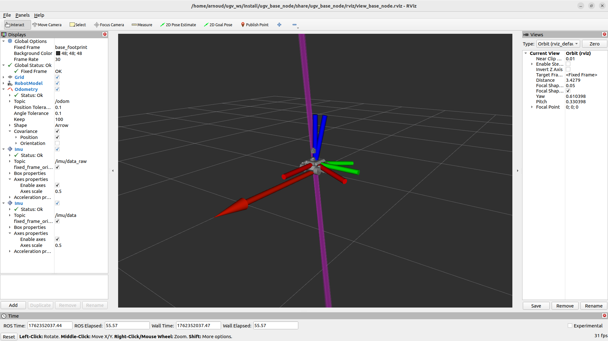

# ugv_base_node
## the node that provides clean odometry to control Waveshare's UGV Rover with ROS2 Humble

This is a fork from [Waveshare' repository](https://github.com/waveshareteam/ugv_ws/tree/ros2-humble-develop/src/ugv_main), created for the course 'Vision for Autonomous Robots' at the University of Amsterdam.

Installation instructions can be found at [ugv_ws](https://github.com/IntelligentRoboticsLab/ugv_ws). The other functionalities dedicated to Waveshare's UGV-Rover in the documention can be found in [ugv main](https://github.com/IntelligentRoboticsLab/ugv_ws/tree/ros2-humble-develop/src/ugv_main/). This package can have some other dependencies which should be build from source, which can be found at [ugv_else](https://github.com/waveshareteam/ugv_ws/tree/ros2-humble-develop/src/ugv_else).

This module defines the two-wheel differential kinematics. It actually consists of two nodes:

- base_node
- base_node_ekf

The nodes subscribe to two topics (/imu/data and /odom/odom_raw), filter this observations and publish a clean topic (/odom).

 # Usage 

The ugv-packages have several parameters, including the hardware configuration, specified as environment variable. These nodes themselves do no use UGV_MODEL, but ugv_description does:

- UGV_MODEL optional rasp_rover, ugv_rover, ugv_beast

As ros-argument the node expects pub_odom_tf, base_footnote_frame and odom_frame.

## Launch

Examples of the launch of these nodes can be found in 

- bringup_imu_origin.launch.py
- bringup_imu_ekf.launch.py

Note that these launch files also start a imu_complementary_filter from [ROS Humble](https://github.com/CCNYRoboticsLab/imu_tools/tree/humble)
In addition, the base_node is also started from:

- bringup_lidar.launch.py

See for more details [ugv_bringup](https://github.com/IntelligentRoboticsLab/ugv_ws/tree/ros2-humble-develop/src/ugv_main/ugv_bringup)

## Run
     
- The node can be started with the following command (executed at the UGV Rover)
        
   ```jsx
   ros2 launch ugv_base_node bringup_base_node.launch.py
   #this launch file combines the start of these two nodes:
   # ros2 run ugv_bringup ugv_bringup
   # ros2 run ugv_base_node base_node --ros-args -r pub_odom_tf:=true
   ```
   or equivallently

   ```jsx
   ros2 launch ugv_base_node bringup_base_node_ekf.launch.py
   #this launch file combines the start of these three nodes:
   # ros2 run ugv_bringup ugv_bringup
   # ros2 run ugv_base_node base_node_ekf --ros-args -r pub_odom_tf:=true
   # ros2 run robot_localization ekf_node --ros-args -r --params-file:=~/ugv_ws/install/ugv_bringup/share/ugv_bringup/param/ekf.yaml --remap /odom/filtered:=/odom
   ```

- The filtered odometry messages could be visualized in RVIZ. The RVIZ can be started (from your laptop) with the following command:
 
```jsx
  ros2 launch ugv_description display.launch.py use_rviz:=true rviz_config:=base_node
```
       
        
The other functionalities are explained in the documention of the each of the [ugv packages](https://github.com/IntelligentRoboticsLab/ugv_ws/tree/ros2-humble-develop/src/ugv_main/) and the [Waveshare documentation](https://www.waveshare.com/wiki/UGV_Rover_Jetson_Orin_ROS2).
    
